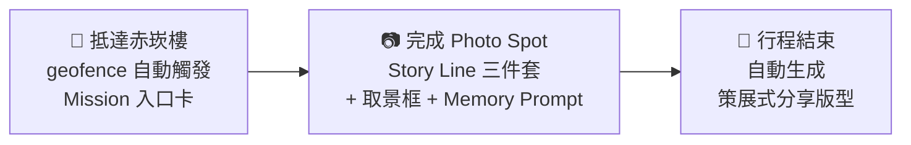
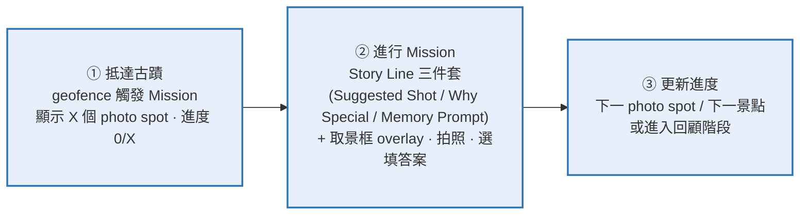
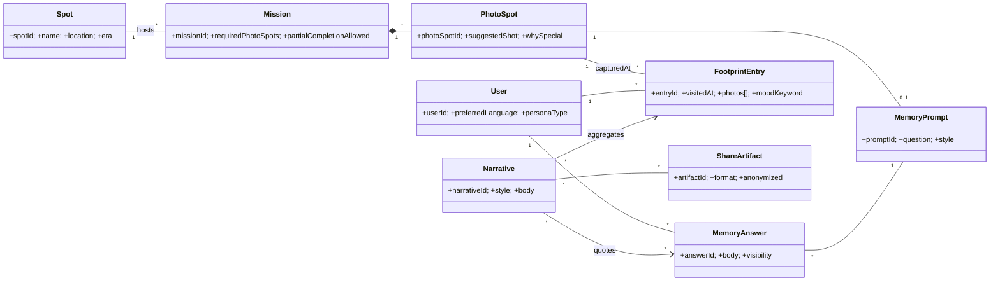
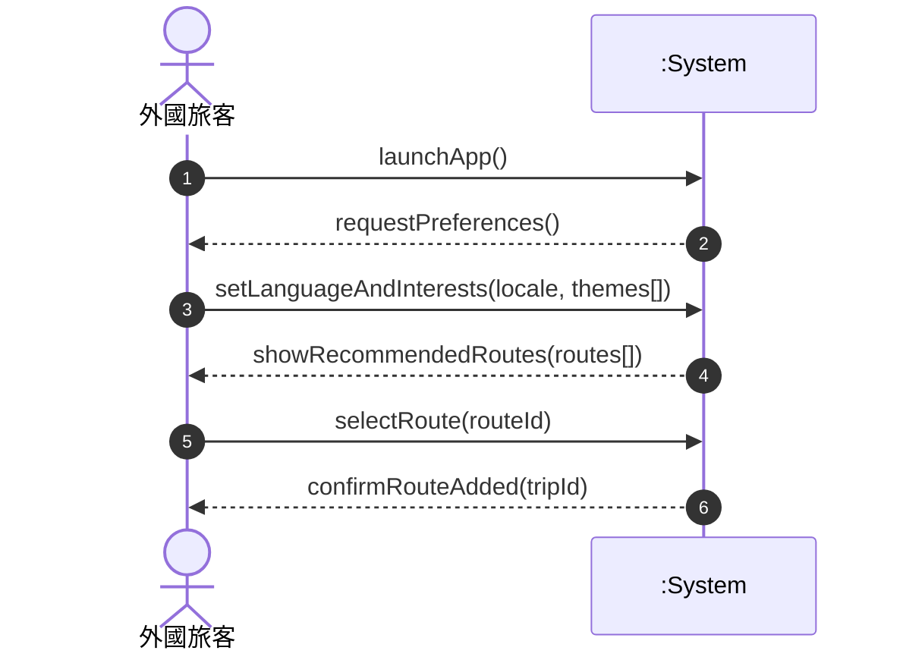
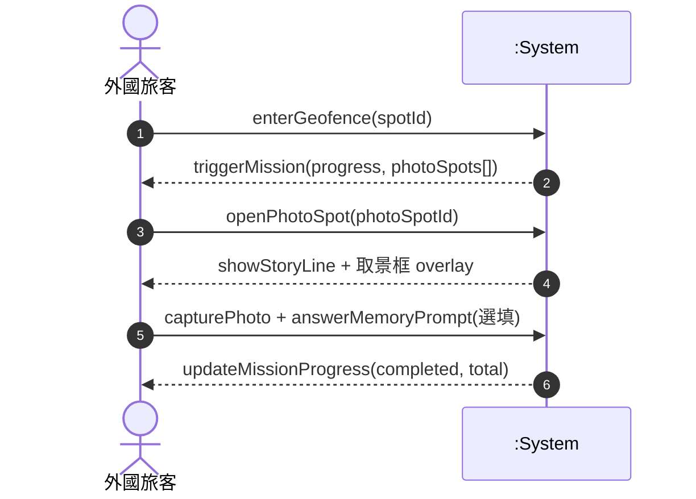
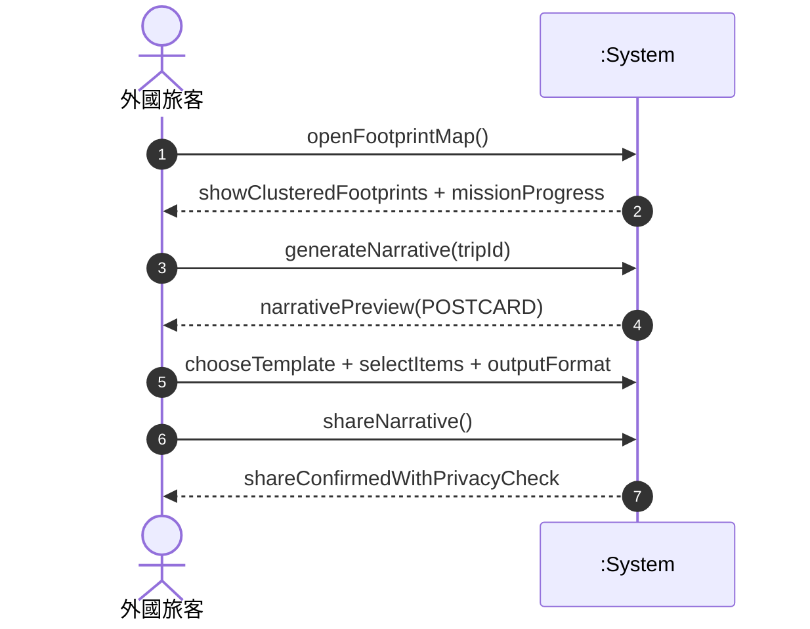
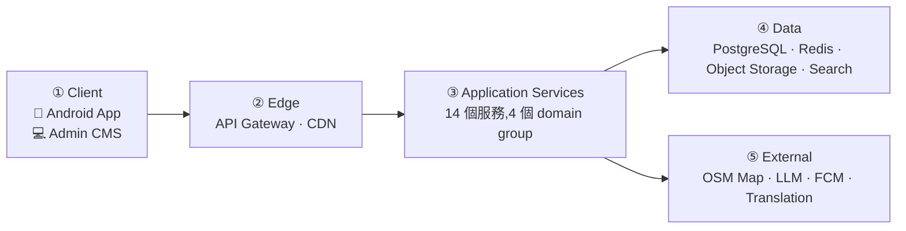
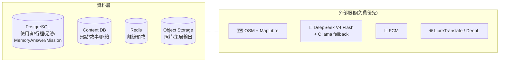

<!-- _class: lead -->
<!-- _paginate: false -->

# Memoir

## 外國旅客在台灣初期探索文化的體驗設計

讓「文化被理解的方式」被重新設計
2026

---

## Agenda

1. **問題與用戶** — 為什麼做、做給誰
2. **核心體驗** — Heritage Mission + Story Line 三件套
3. **設計圖** — Activity / Domain / Sequence
4. **系統架構** — Client → Edge → Services → Data
5. **可行性分析** — 技術 / 成本 / 時程 / 風險
6. **Roadmap 與待補項目**

> Wireframe 與競品對標將後續補上。

---

## 問題:資訊存在,卻無法被理解

旅客在台灣旅行時面對的不是「資訊不足」,而是:

- 古蹟解說牌 = 一堆生硬名詞,**沒有故事連結**
- Google Maps 只給你**點對點路徑**,不告訴你「兩個景點之間有什麼關聯」
- 拍了一堆照片回家後,**只剩相簿,沒有敘事**
- 想分享給朋友,卻**寫不出讓自己滿意的文字**

> 「Photos are just a fragment of the memory; the true value lies in the stories behind them.」

---

## 目標用戶:深度記錄型旅客

不是隨便的觀光客,而是**會花心思記錄旅程、想分享有質感內容**的人。

| 行為 | 描述 |
|---|---|
| 認真拍照 | 不只 selfie,會構圖、找角度 |
| 寫下感受 | IG caption / 部落格 / 旅遊筆記 |
| 講究美感 | 在意社群版面、字型、排版 |
| 重視意義 | 不只是打卡,要旅程「有故事可說」 |

> 主要 Persona:**深度記錄型外國旅客**。

---

## 用戶四大特徵

### 1. 記憶保存的深層需求
照片是片段,故事才是真正的記憶

### 2. 省力高質感悖論
想做精緻內容,但不想花太久時間

### 3. 尋求意義而非打卡
旅程要有反思、有連結、有重量

### 4. 策展式自我表達
分享是展現品味與生活風格,不是炫耀

> 這四點同時推導出產品三項設計原則:**自動觸發 / 短內容優先 / 可策展輸出**。

---

## 解法:Heritage Exploration Mission

抵達古蹟自動觸發「**任務感探索**」,把「拍幾張照」變成「**完成一段敘事**」。

> 允許部分完成(1/3 也算造訪),不強迫完美。

---

## 每個 photo spot 一條「Story Line」

每個 photo spot 配一組三件套 — **拍攝引導 + 文化脈絡 + 個人反思**,構成短內容單元。

### 📷 Suggested Shot
*站在城門正前方,捕捉拱門與人的比例關係。*

### 📜 Why Special
*這座城門曾是防禦與日常往來的重要通道,標誌早期城市生活的邊界。*

### 💭 Memory Prompt
*想像一下:如果你活在那個時代,穿過這座門會是什麼感覺?*

→ 答案存為 **MemoryAnswer**,被敘事生成優先引用
→ 全程選填,降低使用門檻

---

## MVP 範圍:台南單城試點

| 項目 | MVP 範圍 | Future |
|---|---|---|
| **城市** | **台南單城** | 全台擴張 |
| **主題** | 歷史文化古蹟 | 美食 / 建築 / 宗教 |
| **平台** | Android(Kotlin + Compose) | iOS / Web |
| **核心體驗** | Heritage Mission + Story Line + 策展分享 | UGC 互動、好友足跡 |
| **不做** | 自動分群、地圖式行程、商家合作、付費 | 列入 Roadmap |

> 先驗證「**深度記錄型旅客是否願意因為 Mission 而完成一段敘事**」,再考慮擴張。

---

## Activity:現場探索流程(簡化)

> 流程允許部分完成,Memory Prompt 全程選填,降低使用門檻。

---

## Domain Class:核心實體(精選)

> 此處僅顯示 Mission 與 Narrative 周邊核心實體,完整資料模型約 23 個類別。

---

## SSD-1:啟動 → 取得首條推薦路線

> 符合「3 步以內進入推薦路線」的入門設計目標。

---

## SSD-3:Heritage Mission 觸發(核心)

> 涵蓋:geofence 觸發、Story Line 引導、拍照、Memory Prompt 與進度更新。

---

## SSD-4:回顧敘事與策展分享

---

## 系統架構:高階五層

> 5 層架構分離關注點,後續以 Application Services 為展開重點。

---

## Application Services(依旅客旅程分組)

### 🚀 啟動規劃
- Auth Service
- User & Preference
- Route Planning
- i18n / Localization

### 🗺️ 現場探索 ⭐
- **Mission Trigger**(geofence)
- **Photo Guidance**(取景框)
- Content Service
- Navigation Service
- Footprint Service

### 📖 回顧分享 ⭐
- **Narrative Generation**(LLM)
- **Share / Curation Service**
- Review / Rating

### 🛠 內容維運
- Content Service(共用)
- i18n(共用)

⭐ = 與 Google Maps / 一般打卡 App 的**差異化核心**

---

## 資料層 + 外部整合

> 成本原則:**自架開源 > 免費 SaaS > 付費 SaaS**。

---

## 技術棧

| 層 | 技術 | 選擇理由 |
|---|---|---|
| Mobile | Android + Kotlin + Jetpack Compose | 與後端共用語言、原生地圖/geofence 表現好 |
| Backend | Kotlin + Spring Boot(JDK 21)+ Gradle KTS | 與 Android 共享 DTO;Flyway + SpringDoc |
| AI Services | Python 3.11 + uv | LLM 生態最成熟 |
| Admin | React + TypeScript + Vite + react-admin | CRUD-heavy 後台,不從零刻 |
| Data | PostgreSQL · Redis · MinIO | 開源、自架、S3 相容 |
| LLM | **DeepSeek V4 Flash(runtime)+ Ollama(fallback)+ 訂閱版 LLM(build-time 內容)** | demo 流量足夠,零帳單風險 |
| Deploy | k3s + Kustomize + Helm + GitHub Actions + Docker Hub | 自建為主,AKS 為備援 |
| Observability | Prometheus + Grafana + Loki + GlitchTip | 全部自架、零授權費 |

---

## 可行性分析 ① 技術可行性

| 風險點 | 評估 | 緩解 |
|---|---|---|
| **Geofence 在 Android 的精度** | ✅ 可行 | FusedLocationProvider + Geofencing API,精度 10-50m 對古蹟夠用 |
| **LLM 生成品質** | ⚠ 中 | Build-time 用訂閱版 LLM 預生成 80% 內容;runtime 只做個人化敘事 |
| **多語翻譯文化詞彙** | ⚠ 中 | LibreTranslate / DeepL 機翻 + 人工校對 |
| **離線優先** | ✅ 可行 | Room + DataStore 本地快取景點與 Mission |
| **構圖引導 overlay** | ✅ 可行 | Compose Canvas + CameraX,前期靜態 overlay 即可 |

> 技術棧皆為團隊熟悉、社群成熟、文件完整的選項,無 R&D 風險。

---

## 可行性分析 ② 成本可行性(零帳單)

| 項目 | 方案 | 月成本 |
|---|---|---|
| LLM API(runtime) | DeepSeek V4 Flash | **$0** |
| LLM(build-time 內容) | 個人訂閱 ChatGPT Plus / Claude Pro | 已有訂閱 |
| 地圖 | OSM + MapLibre / Leaflet | **$0** |
| 推播 | FCM(無上限) | **$0** |
| 翻譯 | LibreTranslate 自架 / DeepL Free 50 萬字 | **$0** |
| 物件儲存 | MinIO 自架 | **$0** |
| Hosting | k3s 自建(VM / 校內機房) | **$0** |
| 觀測 | Prometheus + Grafana + Loki(自架) | **$0** |
| **總計** | | **$0 / 月** |

> 唯一可能付費的是 demo 期間的 VM(若用 Azure)— 走免費學生額度。

---

## 可行性分析 ③ 時程與排程

> 6 週 agile sprint,團隊 6-8 人(2 設計 + 4-6 系統)。

| Sprint | 主要產出 | Demo 重點 |
|---|---|---|
| **S1** | Backbone + Onboarding + 種子景點 | SSD-1 走通 |
| **S2** | Mission Trigger + 三件套 UI | 抵達自動觸發 |
| **S3** | 拍照 + Memory Prompt + 進度 | 完成一個 Mission |
| **S4** | Footprint + 多語 + 後台 | 跨語言看景點 |
| **S5** | Narrative 生成 + 策展版型 | 一鍵生成故事 |
| **S6** | 分享輸出 + 整合測試 + demo | E2E full flow |

---

## 風險與緩解

| 風險 | 影響 | 緩解 |
|---|---|---|
| **內容深度不足** — 景點故事品質決定 Persona 是否買單 | 🔴 高 | Build-time 用訂閱版 LLM + 文史顧問人工校對,而非 runtime 即時生成 |
| **Mission 強制完成感壓力** | 🟡 中 | 1/3 完成即視為造訪;Memory Prompt 全程選填 |
| **Geofence 觸發 false positive** | 🟡 中 | 雙重判定:GPS + WiFi/藍牙 beacon(後期);現場校正 |
| **LLM 額度爆掉** | 🟡 中 | Ollama 本地 fallback;敘事生成排隊機制 |
| **demo 機網路** | 🟡 中 | 預先快取台南所有景點 + Story Line + 內容 |

---

## Roadmap & 待補項目

### MVP 後(優先序)
1. iOS 端(KMP 共用 domain/data)
2. 多城市擴張(台北 → 全台)
3. UGC 標籤協作
4. 好友足跡與互動

### 本次簡報後續補上
- 🎨 **Figma Wireframe** — 主畫面、Mission 卡、Story Line、策展版型
- 📊 **競品對標** — Google Maps / Visit Tainan / Polarsteps / Atlas Obscura 功能差距
- 🎬 **Demo 影片** — E2E 走一次台南赤崁樓 Mission

---

<!-- _class: lead -->

# Q & A

🔗 Repo:github.com/killin0415/memoir

> 「Photos are just a fragment of the memory;
> the true value lies in the stories behind them.」

